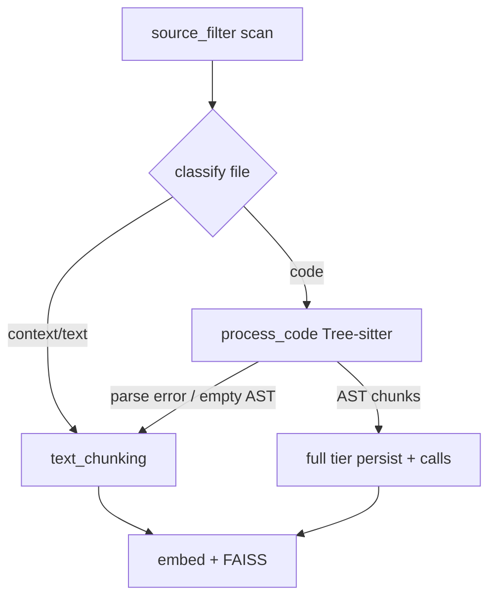

# CodeWeave language support

CodeWeave indexes repositories in three **intelligence tiers**. Grammars ship in the
single Python package `tree-sitter-languages` (see `backend/requirements.txt`); there
are no per-language wheel installs.

| Tier | Meaning | Chunk strategy | Call graph |
|------|---------|----------------|------------|
| **full** | Tree-sitter AST + function/class queries | `ast_semantic` | Yes |
| **parse** | Tree-sitter parse only (no function queries) | text fallback | No |
| **text** | Plain / structural text chunking | `text_structural` or `text_sliding` | No |

Setup and agents can query the machine-readable manifest:

```python
from intelligence_service import RepositoryIntelligenceService
manifest = RepositoryIntelligenceService().get_language_capabilities()
```

Or run a grammar health check for your repo:

```bash
source backend/.venv/bin/activate
export PYTHONPATH=backend/infra/codeweave
python backend/infra/codeweave/scripts/probe_grammars.py /path/to/repo
```

## Full tier (AST semantic + call graph)

Tree-sitter **function queries** extract named functions/methods; **call extraction**
walks `call` / `call_expression` nodes; chunks are deduplicated in `ast_chunking`.

| Language id | Typical extensions |
|-------------|------------------|
| python | `.py`, `.pyi`, `.pyw` |
| javascript | `.js`, `.jsx`, `.mjs`, `.cjs` |
| typescript | `.ts`, `.mts`, `.cts` |
| tsx | `.tsx` |
| java | `.java` |
| cpp | `.cpp`, `.cc`, `.cxx`, `.hpp`, `.hh`, `.hxx` |
| c | `.c`, `.h` |
| c_sharp | `.cs`, `.csx` |
| go | `.go` |
| rust | `.rs` |
| ruby | `.rb` |
| php | `.php`, `.phtml` |
| kotlin | `.kt`, `.kts` |
| scala | `.scala`, `.sc` |
| perl | `.pl`, `.pm` |
| r | `.r`, `.R` |
| lua | `.lua` |
| bash | `.sh`, `.bash`, `.zsh`, `.ksh` |
| haskell | `.hs`, `.lhs` |
| julia | `.jl` |
| fortran | `.f90`, `.f95`, `.f03`, `.f08` |
| objc | `.m`, `.mm` |
| elisp | `.el` |
| hack | `.hack` |

## Parse tier (Tree-sitter, no semantic queries)

Extensions map to a grammar in `path_language.py`, but `language_specs` has no
function queries. Ingestion parses then falls back to text chunking.

Examples: `commonlisp`, `css`, `dockerfile`, `elixir`, `elm`, `erlang`, `json`,
`markdown`, `make`, `ocaml`, `ql`, `sql`, `toml`, `yaml`, and others in
`LANGUAGE_REGISTRY` without `supports_semantic_chunking`.

## Text tier (no bundled grammar)

Indexed via regex/heuristic chunkers in `text_chunking.py`:

| Category | Examples |
|----------|----------|
| Source without grammar | `.dart`, `.swift`, `.vue`, `.proto`, `.zig`, … |
| Markup (no reliable AST chunks) | `.html`, `.css`, `.scss` |
| Data / config | `.json`, `.sql`, `.txt`, `.log` |
| Context docs | `.md`, `Dockerfile`, `docker-compose.yml` |

## Ingestion pipeline



## Setup

One script installs everything and warms models + grammars detected in the project:

```bash
./setup_coweave.sh
```

Optional: probe only semantic grammars (CI smoke test):

```bash
PYTHONPATH=backend/infra/codeweave python backend/infra/codeweave/scripts/probe_grammars.py --all-semantic
```
