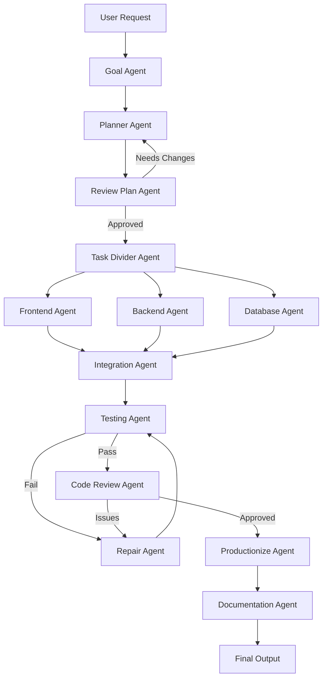

# 🤖 CodeWeave Studio

A multi-agent system built on LangGraph that orchestrates specialized AI agents for end-to-end software development - from goal understanding to production-ready code.

[](LICENSE)
[](https://www.python.org/downloads/)
[](https://github.com/langchain-ai/langgraph)

## 🏗️ Built on CodeWeave

CodeWeave Studio is built on **[CodeWeave](https://github.com/RikinR/code_weave)** - a codebase intelligence system that provides repository understanding, semantic search, and architectural analysis. CodeWeave handles the heavy lifting of repository context, allowing the agents to focus on implementation logic.

## 📋 Overview

CodeWeave Studio transforms natural language development requests into working code through a pipeline of specialized agents:



## 🎯 Key Features

- **🧠 Intelligent Goal Understanding**: Converts ambiguous requests into precise, actionable goals
- **📐 Smart Planning**: Generates implementation strategies aligned with existing architecture
- **🔍 Rigorous Review**: Multiple review stages (plan review, code review, skeptic review) ensure quality
- **🔄 Parallel Implementation**: Frontend, backend, and database agents work in parallel
- **🧪 Automated Testing**: Generates and runs tests, validates changes
- **🔧 Self-Repair**: Automatically fixes issues found during testing and review
- **📝 Production Ready**: Harden and document changes for production deployment

## 🏗️ Agent Architecture

### Core Agents

| Agent | Purpose | Inputs | Outputs |
|-------|---------|--------|---------|
| **Goal Agent** | Converts user request into structured goals | user_request, conversation_history, repository_metadata | goals |
| **Context Agent** | Assembles repository intelligence | goals, repository_root, code_files_changed | relevant_context |
| **Planner Agent** | Generates implementation strategy | goals, relevant_context, decision_memory | plan |
| **Review Plan Agent** | Critiques plan before coding | plan, goals, relevant_context | review_plan, review_issues |
| **Task Divider Agent** | Decomposes plan into parallel tasks | plan, goals, relevant_context | frontend_tasks, backend_tasks, database_tasks |

### Implementation Agents

| Agent | Purpose | Inputs | Outputs |
|-------|---------|--------|---------|
| **Backend Agent** | Implements backend services | backend_tasks, working_context, relevant_context | backend_result, patches |
| **Frontend Agent** | Implements UI components | frontend_tasks, working_context, relevant_context | frontend_result, patches |
| **Database Agent** | Modifies schema and migrations | database_tasks, working_context, relevant_context | database_result, patches |

### Quality Assurance Agents

| Agent | Purpose | Inputs | Outputs |
|-------|---------|--------|---------|
| **Integration Agent** | Merges parallel implementations | frontend_result, backend_result, database_result | integrated_state, patches |
| **Testing Agent** | Validates integrated changes | integrated_state, patches, plan | tests_generated, test_results |
| **Code Review Agent** | Senior-engineer code review | integrated_state, test_results, plan | review_issues |
| **Repair Agent** | Resolves failures and issues | review_issues, test_results, integrated_state | repair_history, patches |
| **Productionize Agent** | Hardens code for production | integrated_state, patches, test_results | production_changes, patches |
| **Documentation Agent** | Generates user-facing docs | production_changes, integrated_state, plan | docs |


## 🚀 Getting Started

### Prerequisites

- Python 3.11+
- CodeWeave installed and configured
- LangGraph

### Installation

```bash
# Clone the repository
git clone https://github.com/yourusername/codeweave-studio.git
cd codeweave-studio

# Install dependencies
pip install -r requirements.txt
```

## 🔄 Workflow Execution Flow

1. **Goal Extraction**: User request → structured goals
2. **Plan Generation**: Goals + context → implementation plan
3. **Plan Review**: Plan evaluated, revisions if needed
4. **Task Division**: Plan decomposed into parallel tasks
5. **Parallel Implementation**: Frontend/backend/database agents execute
6. **Integration**: All implementations merged
7. **Testing**: Automated tests validate changes
8. **Repair Loop**: Fix issues found in testing
9. **Code Review**: Senior review of changes
10. **Productionize**: Harden code for production
12. **Documentation**: Generate final user-facing docs

## 🎮 Agent Contracts

Each agent has well-defined contracts specifying:
- **Purpose**: What the agent does
- **Inputs**: Required state keys
- **Outputs**: State keys produced
- **Tools**: Available functions
- **Success Criteria**: When the agent has succeeded
- **Failure Modes**: Common failure scenarios

See `node_contracts.json` for complete details.


### Visualizing the Graph

```python
from graph_implementation import app

# Save graph visualization
output = app.get_graph(xray=True).draw_mermaid_png()
with open("graph.png", "wb") as f:
    f.write(output)
```


## 📄 License

This project is licensed under the Apache License 2.0 - see the [LICENSE](LICENSE) file for details.

## 🙏 Acknowledgments

- **CodeWeave** - Providing the codebase intelligence foundation
- **LangGraph** - The graph-based orchestration framework
- **LangChain** - LLM integration and tooling


---